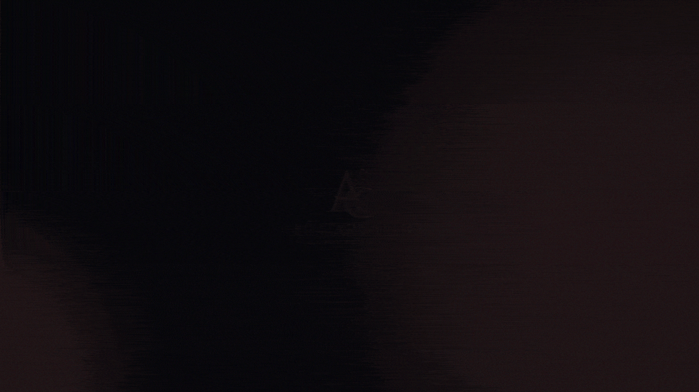

<h1 style="text-align: center; font-weight:300;">Identidade Digital Espaço Alê Carvalho</h1>

Projeto solicitado pelo professor <a href="https://github.com/marcosvcsantos" style="font-weight: 700;">Marcos Vinicius</a> dentro da matéria de Desenvolvimento de Sistemas pelo <i style="font-weight: 700;" >SENAI - Alagoinhas.</i>

<h2 style="font-style:italic; font-weight:300;">Tecnologias</h2>

 

As tecnologias utilizadas no projetos foram escolhidas pelo professor através dos requisitos fornecidos.

